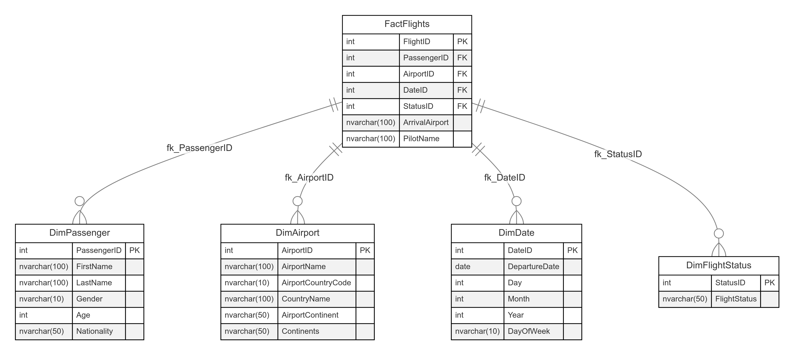

### 1. Diagrama del Modelo Realizado

### 2. Manual Técnico

#### **Descripción del Modelo**

El modelo de datos creado está basado en el enfoque **Star Schema** (Esquema Estrella) con una tabla de hechos y varias tablas de dimensiones. Este diseño es ideal para realizar análisis multidimensionales y facilitar consultas eficientes para el análisis de vuelos.

- **Tabla de Hechos (`FactFlights`)**:
  - Esta tabla contiene los registros de los vuelos realizados. Cada registro incluye claves foráneas que hacen referencia a las tablas de dimensiones.
  - **Campos principales**:
    - `FlightID`: Identificador único del vuelo.
    - `PassengerID`: Clave foránea que referencia al pasajero (`DimPassenger`).
    - `AirportID`: Clave foránea que referencia al aeropuerto de salida (`DimAirport`).
    - `DateID`: Clave foránea que referencia a la fecha de salida (`DimDate`).
    - `StatusID`: Clave foránea que referencia al estado del vuelo (`DimFlightStatus`).
    - `ArrivalAirport`: Nombre del aeropuerto de llegada.
    - `PilotName`: Nombre del piloto.

- **Tablas de Dimensiones**:
  - **`DimPassenger`**:
    - Información sobre los pasajeros. 
    - Incluye datos como el nombre, apellido, género, edad, y nacionalidad.
  - **`DimAirport`**:
    - Información sobre los aeropuertos.
    - Incluye el nombre del aeropuerto, país, código del país, continente y nombre del continente.
  - **`DimDate`**:
    - Información sobre las fechas de salida de los vuelos.
    - Incluye la fecha de salida, día, mes, año y día de la semana.
  - **`DimFlightStatus`**:
    - Información sobre el estado del vuelo.
    - Incluye el estado del vuelo (por ejemplo, `On Time`, `Delayed`, `Cancelled`).

#### **Descripción del Proceso ETL**

El proceso de **ETL (Extracción, Transformación y Carga)** que realizamos sigue los siguientes pasos:

1. **Extracción**:
   - Los datos de los vuelos fueron extraídos de un archivo CSV que contenía información como el nombre del pasajero, aeropuerto, fechas de salida, y estado del vuelo.
   
2. **Transformación**:
   - **Limpieza de Datos**: Se eliminaron los registros con valores nulos o inválidos.
   - **Conversión de Fechas**: Las fechas de salida fueron normalizadas y convertidas al formato correcto para ser almacenadas en SQL Server. Se eliminaron registros con fechas no válidas (`NaT`).
   - **Estandarización de Texto**: Los valores de texto como nombres de aeropuertos, continentes, y estados de vuelo fueron convertidos a minúsculas para mantener la consistencia.
   - **Escape de Comillas Simples**: Para evitar errores de sintaxis en SQL Server, las comillas simples en los nombres y otros campos de texto fueron escapadas (`'` → `''`).

3. **Carga**:
   - Los datos fueron cargados en las tablas de dimensiones (`DimPassenger`, `DimAirport`, `DimDate`, `DimFlightStatus`) eliminando previamente cualquier duplicado.
   - Luego, los datos de la tabla de hechos (`FactFlights`) se poblaron usando las claves foráneas de las tablas de dimensiones. Para cada vuelo, se realizaron consultas a las tablas de dimensiones para obtener las claves correspondientes (`PassengerID`, `AirportID`, `DateID`, `StatusID`), y esos valores se insertaron en la tabla `FactFlights`.

#### **Proceso de Consulta**

Una vez los datos se cargaron correctamente en las tablas, las consultas fueron diseñadas para realizar análisis sobre los datos. Estas consultas incluyeron:
- Conteo de vuelos totales.
- Conteo de pasajeros por género.
- Los 5 aeropuertos con más pasajeros.
- Los 5 países y continentes más visitados.
- Conteo de vuelos por estado de vuelo (`On Time`, `Delayed`, etc.).
- Conteo de vuelos por mes y año.

Estas consultas se ejecutaron sobre las tablas utilizando `JOINs` entre la tabla de hechos y las tablas de dimensiones para obtener información combinada y facilitar el análisis.

Este modelo es escalable y puede soportar un análisis más detallado conforme los datos crezcan, permitiendo realizar consultas eficientes y generando reportes de análisis sobre los vuelos.